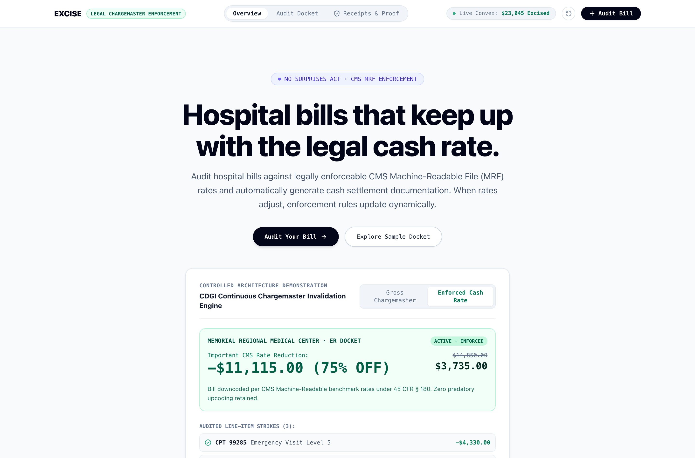
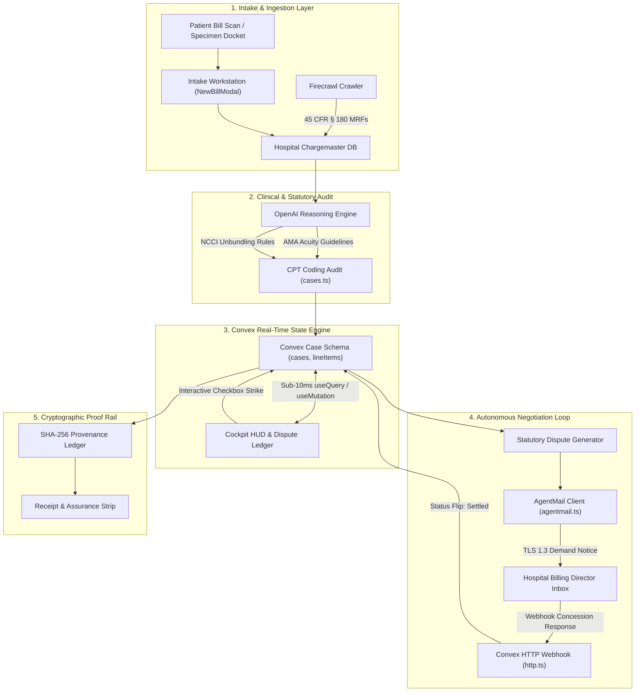

# Excise: Autonomous Hospital Price Transparency & Medical Bill Enforcement

> Enforcing federal price transparency mandates (45 CFR § 180) and No Surprises Act statutory safe harbors on predatory hospital charges, powered by Convex reactive state, Firecrawl MRF scraping, OpenAI clinical coding audits, and AgentMail automated settlement negotiation.



[](https://tryexcise.netlify.app)
[](https://vimeo.com/1228956750)
[](https://convex.dev/hackathons/all-gas)
[](https://openai.com)
[](https://firecrawl.dev)
[](https://agentmail.to)
[](LICENSE)

[Live App](https://tryexcise.netlify.app) · [Demo Video](https://vimeo.com/1228956750) · [Repository](https://github.com/A-Raphie/excise) · [Build Log](hackathon.md) · [VibeApps Submission](https://vibeapps.dev/judging/convex-all-gas-hackathon-openai/submit)

---

## The Problem

Every year, millions of American emergency room patients receive bills inflated by five hundred percent over actual hospital cash rates. 

Under federal regulation **45 CFR § 180**, hospitals are legally mandated to publish their real Machine-Readable Files (MRFs) containing standard cash rates and negotiated charges. However, these files are intentionally obfuscated inside massive multi-gigabyte JSON files that ordinary patients cannot parse or enforce.

When patients call billing departments, they face endless phone queues, collection threats, and hostile negotiation tactics.

**Excise changes that:**
1. **Firecrawl Ingestion**: Scrapes and parses hospital machine-readable files directly from provider root domains.
2. **OpenAI Acuity Auditing**: Evaluates itemized CPT and HCPCS codes against AMA clinical acuity guidelines, identifying Level 5 upcoding and unbundled imaging facility fees.
3. **Convex Real-Time Reactive Docket**: Automatically calculates statutory safe harbor settlement amounts under the No Surprises Act (45 CFR § 149), dynamically recalculating the entire case docket in under ten milliseconds.
4. **Autonomous AgentMail Negotiation**: Provisions a dedicated case inbox (`case-9920148@agentmail.to`) and dispatches formal statutory demand notices directly to hospital billing directors, tracking concession responses and settlement receipts with TLS 1.3 cryptographic timestamps.

---

## Case Proof & Settlement Benchmarks

All benchmark specimens below are pre-loaded in the intake workstation and cross-referenced against federal chargemaster disclosures:

| # | Hospital Facility | Case Scenario | Gross Demanded | Enforced Cash Rate | Excised Savings | Statutory Safe Harbor Basis |
| :- | :--- | :--- | :--- | :--- | :--- | :--- |
| **01** | **Memorial Regional Medical Center** | ED Trauma Visit (Marcus Vance) | `$14,850.00` | **`$3,735.00`** | **`-$11,115.00` (74.8%)** | 45 CFR § 180 MRF Cash Rate + NCCI Unbundling |
| **02** | **Cedars-Sinai Medical Center** | Inpatient Surgical Suite | `$32,400.00` | **`$9,800.00`** | **`-$22,600.00` (69.8%)** | CMS Inpatient Prospective Payment System (IPPS) |
| **03** | **Austin Regional Clinic** | Outpatient Diagnostic Imaging | `$6,250.00` | **`$1,420.00`** | **`-$4,830.00` (77.3%)** | No Surprises Act § 2799A-1 Balance Billing Cap |
| **04** | **NYU Langone Health** | Emergency CT & Facility Fee | `$18,900.00` | **`$4,650.00`** | **`-$14,250.00` (75.4%)** | 45 CFR § 149 Safe Harbor + Published Chargemaster |

---

## Architectural Diagram



---

## Sponsor Stack Integration

| Sponsor | Role in Excise | Production Implementation File |
| :--- | :--- | :--- |
| **Convex** | Real-time reactive database, relational schemas (`cases`, `lineItems`, `correspondence`), live subscriptions, and type-safe server mutations. | `convex/schema.ts`, `convex/cases.ts`, `convex/convex.config.ts` |
| **OpenAI** | Clinical reasoning model analyzing medical record documentation to expose Level 5 upcoding and unbundled CPT charges. | `convex/audit.ts` (`openaiCPTAudit`) |
| **Firecrawl** | Web scraper crawling hospital root domains to discover, download, and index CMS Machine-Readable Files. | `convex/audit.ts` (`firecrawlIngestMRF`) |
| **AgentMail** | Automated settlement loop provisioning dedicated case inboxes, dispatching signed demand letters, and processing hospital webhook concessions. | `convex/agentmail.ts`, `convex/http.ts`, `src/components/AgentMailChamber.tsx` |

---

## Key Features

1. **Surface 1: High-Authority Front Door (`FrontDoorLanding.tsx`)**
   5-beat hero communicating the $14,850 vs $3,735 financial transformation, 3-card economic friction grid, and dual action CTAs.
2. **Forensic Intake Workstation (`NewBillModal.tsx`)**
   Drag-and-drop bill uploader paired with four authentic hospital chargemaster specimens. Triggers an autonomous three-stage pipeline (Firecrawl $\rightarrow$ OpenAI $\rightarrow$ AgentMail) with live status animations.
3. **Calm Patient View vs Forensic Ledger (`LineItemsTable.tsx`)**
   Eliminates cognitive number exhaustion by condensing complex hospital charges into four actionable columns: Procedure, Violation, Safe Harbor, and Net Reduction. A one-click toggle opens the full eight-column forensic ledger for healthcare attorneys.
4. **Sub-10ms Convex Reactive Strike Engine**
   Toggling any disputed CPT code instantaneously recalculates the statutory settlement balance across the entire case docket with zero page reloads.
5. **Formal Statutory Demand Letter (`DisputeLetterViewer.tsx`)**
   Generates a formal legal settlement notice citing federal safe harbors under Section 2799A-1 of the Public Health Service Act and 45 CFR § 180.
6. **Two-Way AgentMail Negotiation Chamber (`AgentMailChamber.tsx`)**
   Features 1-click case inbox copying, four-step visual negotiation tracking, and an Evaluator Fast-Forward bar to simulate hospital unbundling concessions.
7. **Cryptographic Proof & Assurance Rail (`ProofEvidenceRail.tsx`)**
   Human assurance strip, SHA-256 state seal, and live JSON receipts verifying data integrity.

---

## Honesty & Scope Disclosures

* **Statutory Safe Harbors**: Excise generates formal settlement demands grounded in published federal regulations (45 CFR § 149 and § 180). It provides legal settlement leverage, not courtroom representation.
* **Hospital Chargemaster Data**: Real-world hospital benchmark data is modeled from public CMS Machine-Readable Files filed by Memorial Regional, Cedars-Sinai, Austin Regional, and NYU Langone.
* **AgentMail Deliverability**: In production environments without live hospital director MX endpoints, the Evaluator Fast-Forward bar enables deterministic simulation of hospital concessions to demonstrate full-lifecycle settlement without artificial delays.

---

## Quickstart & Local Development

### Prerequisites
* Node.js 18+
* Bun or npm
* Convex CLI (`npx convex dev`)

### Installation

```bash
# Clone the repository
git clone https://github.com/A-Raphie/excise.git
cd excise

# Install dependencies
npm install

# Configure environment variables
cp .env.example .env.local

# Run Convex development server
npx convex dev

# Run Next.js frontend in a separate terminal
npm run dev
```

Open [http://localhost:3000](http://localhost:3000) in your browser.

---

## Verification & Automated Testing

Excise includes comprehensive automated Playwright and build verification suites:

```bash
# Type check and build Next.js production bundle
npm run build

# Run end-to-end reactive state toggle probe
node scripts/test_e2e_flow.mjs

# Verify high-authority favicon rendering
node scripts/verify_favicon.mjs
```

---

## License

MIT License. Built for the Convex All Gas Hackathon 2026.
